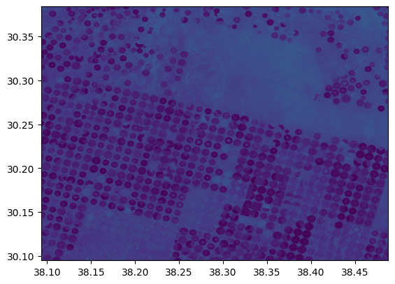
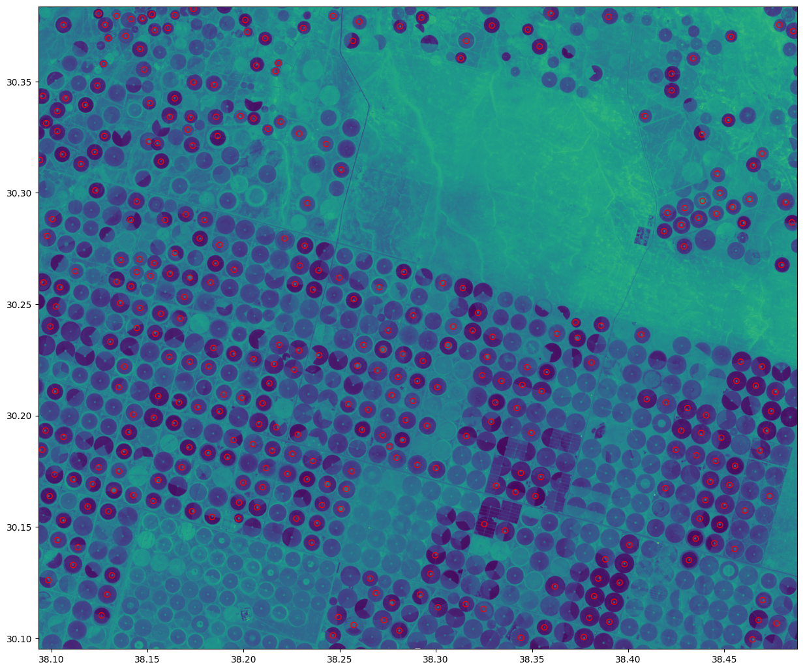

# DeteccaoPivoIrrigacao
Detecção e localização de pivôs de irrigação com o uso do OpenCV em imagens de satélites

## Google Colab
link para visualizar a execução no colab: https://colab.research.google.com/drive/1rLtIHmEQkaTBbPqjP9Ds_PW1gQt2QxQX#scrollTo=Jrr-vntN5bWe

## 🖼️ Imagem Original

## 🖼️ Resultado Final

